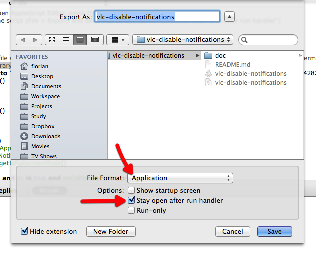
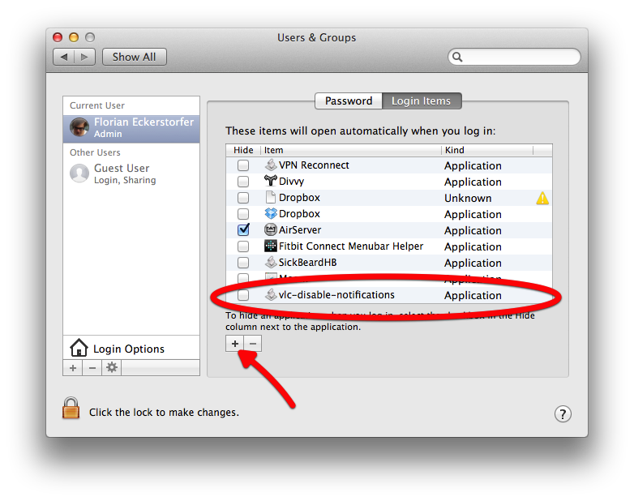

AppleScript to disable OS X Notification Center while VLC is playing a video in full screen mode
================================================================================================

By [Florian Eckerstorfer](http://florianeckerstorfer.com).

Installation
------------

1. Open vlc-disable-notifications.scpt in AppleScript Editor (found in `/Applications/Utilities`)
2. Find out the name of your Notification Center plist file by typing in a Terminal:

    `ls ~/Library/Preferences/ByHost/com.apple.notificationcenterui.*.plist`

3. Copy the file name and paste it into the script (see the comments)
    
4. **File** > **Export** and select **Applicaiton** as *File Format*. Activate the **Stay open after run handler** checkbox.
    
5. Start the application
6. Optional: if you want to start the application when you start OS X you can add it to your users **Login Items**. This can be done in the System Preferences > User
    

Acknowledgment
--------------

I constructed this script by copying snippets from all over the Internet.

* [Is Notification Center enabled?](http://apple.stackexchange.com/questions/59572/get-os-x-notification-center-state-from-the-command-line)
* [Activate/Deactivate Notification Center](http://apple.stackexchange.com/questions/57668/what-hooks-exist-into-notification-center-twitter-so-that-i-can-tweet-programm/57830#57830)
* [Is VLC playing a video?](http://www.adiumxtras.com/index.php?a=xtras&xtra_id=6722)
* [Is VLC in full screen mode?](http://forum.videolan.org/viewtopic.php?f=12&t=98828)
